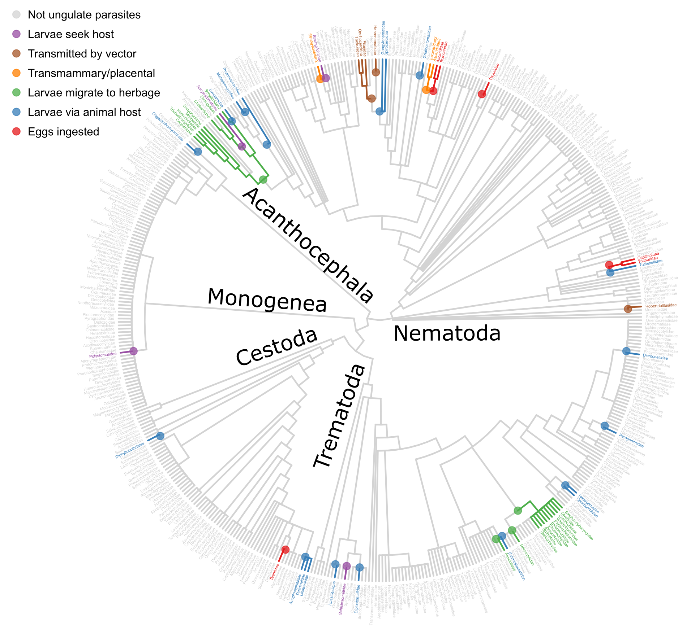

This repo includes the data and analyses for a scientific paper examining parasite life cycle evolution when grazing mammals are hosts. 

# Background

We found it puzzling that so many parasitic worms infect intermediate hosts, like small invertebrates, before infecting grazers. Parasite eggs contaminate vegetation, which grazers consume, so there is not an obvious trophic barrier to parasite transmission. So why do they bother infecting intermediate hosts? One possibility is that intermediate hosts help parasite propagules like eggs disperse away from grazer faeces, because grazers are known to avoid foraging near their own faeces. If grazer faecal avoidance represents a barrier to parasite transmission, then direct infection of grazers via non-motile parasite eggs should be rare. To assess this and to better understand how worms typically infect grazing mammals, we quantified the number of taxa exhibiting different transmission strategies as well as the number of times different transmission routes have evolved.

# Analyses

There are two main analyses presented here. The first [maps helminth transmission strategies onto a tree](analysis/mapping/mapping_ungulate_helminths.md) with the goal of understanding the origins of grazer parasitism in worms and by what infection route it usually evolves.

### Phylogenetic mapping

We found that ungulate parasitism has evolved over 20 times in parasitic worms, and it often originates via intermediate host consumption (i.e. the grazer consumes an infected invertebrate). This makes sense, because most parasitic worms are transmitted via intermediate hosts, so this is the ancestral condition in many clades. Some parasitic worms are transmitted to grazers via free larvae on vegetation. This strategy has not evolved as frequently as intermediate-host transmission, but it has resulted in more descendent taxa, i.e. it is associated with diversification within grazers. Finally, consistent with our intuition, direct egg transmission is rare. It has not evolved as frequently as intermediate host consumption, nor has it resulted in as many descendants as herbage transmission.

### Propagule life history

The second analysis examines the relationship between transmission mode and parasite propagule characteristics, specifically their size and development. If propagules have different target hosts, say a grazer or an invertebrate, that may be reflected in their life history. The data for this analysis comes from a previously published [database](https://esajournals.onlinelibrary.wiley.com/doi/full/10.1002/ecy.1680). In three notebooks, I examine how propagule size and development are associated with transmission mode; [here for nematode propagule size](analysis/fitness_comps_lc_db/03LHcomps_Egg_Size.md), [here for cestode propagule size](analysis/fitness_comps_lc_db/05LHcomps_CestPropagules.md), and [here for nematode propagule development](analysis/fitness_comps_lc_db/04LHcomps_Egg_Devo.md). The most striking result to come out of these analyses was that nematode propagules almost always undergo development when targeting ungulate first hosts but only rarely when targeting invertebrate first hosts.

Ungulates avoid their own faeces. Invertebrates, at least some of them, do not avoid ungulate faeces. If a worm targets an invertebrate, it pays to be infective immediately, so no transmission opportunities are lost. If a worm targets an ungulate directly, a long development need not be as costly, and it may allow for dispersal away from faeces or faeces disintegration. 

# Reference

This paper is currently under revision.