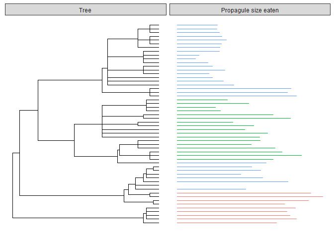
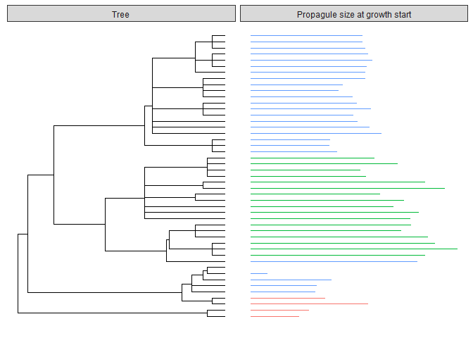
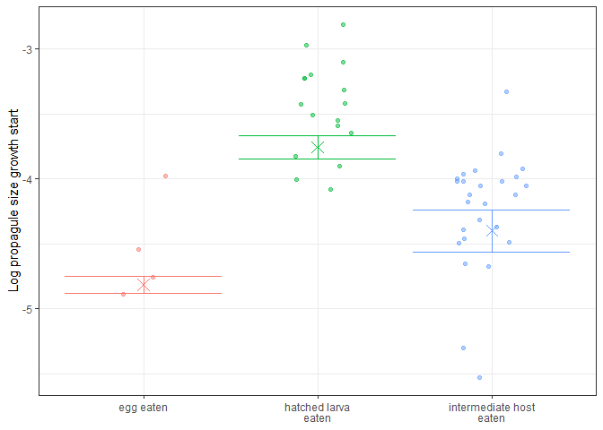
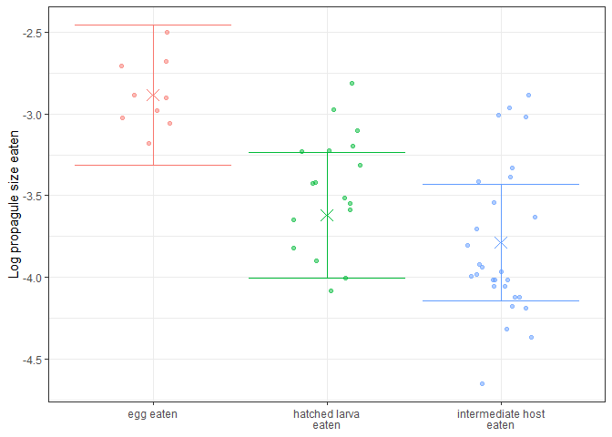
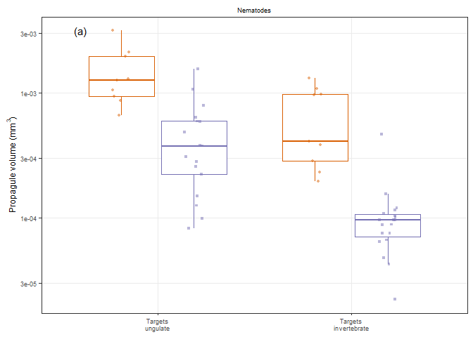

Ungulate nematode life history - Propagule size
================

I use the life cycle database to explore ideas about the costs and
benefits of different infection routes exhibited by helminths of grazing
mammals (ungulates). In this document, I specifically focus on egg
sizes. The basic approach to data filtering and summarizing was
described [previously](01LHcomps_Adult_Size.html).

Are propagules bigger or smaller depending on the transmission strategy?
There are two ways to consider propagule size. First, we can look at the
size at ingestion, i.e. the size of the parasite propagule that is
consumed. Second, we can look at the size at the beginning of growth,
which is smaller for worms that hatch out of the eggs after ingestion to
begin growth.

For nematode parasites of ungulates in the dataset, I downloaded a tree
from the open tree of life (see [here](getting_tree_ung_nems.Rmd)).
Let’s import the tree and then plot some variables alongside the tree
to understand the phylogenetic distribution of the different traits of
interest.

Here is the tree on the left with bars representing propagule size
consumed on the right.

<!-- -->

It looks like the propagule size is phylogenetically structured, though
some of this is the difference in strategy. Red bars are egg
transmitted, while green are hatched larvae, which are smaller.

Now the same plot for the propagule size at initiation of growth in the
next host. The red values (for eggs) are now smaller, as this represents
embryo size, i.e. this is a size estimate for the worm that hatches out
of the egg after consumption by the first host.
<!-- -->

Previously, we saw that both hatching and life cycle complexity are
phylogenetically structured, so we won’t repeat those plots here.

The phylogenetic structure of transmission strategies reduces the power
of phylogenetic models. Nonetheless, let’s make some models for
propagule size. I fit phylogenetic regression models, which are
generalized least squares models that assume the error structure in the
data is phylogenetically structured.

We’ll examine our two propagule size measures in succession, starting
with propagule size at the initiation of growth. As a first modelling
step, we’ll quantify the role of phylogeny, without any predictors.

    ## Generalized least squares fit by maximum likelihood
    ##   Model: log10(propagule_size_grow_start) ~ 1 
    ##   Data: red_dat_size 
    ##        AIC      BIC    logLik
    ##   77.82897 83.37941 -35.91449
    ## 
    ## Correlation Structure: corPagel
    ##  Formula: ~1 
    ##  Parameter estimate(s):
    ##     lambda 
    ## -0.1946229 
    ## 
    ## Coefficients:
    ##                 Value   Std.Error   t-value p-value
    ## (Intercept) -3.845198 0.001131494 -3398.336       0
    ## 
    ## Standardized residuals:
    ##        Min         Q1        Med         Q3        Max 
    ## -3.0622970 -0.9071406 -0.2879988  0.5031047  1.8833406 
    ## 
    ## Residual standard error: 0.5500096 
    ## Degrees of freedom: 47 total; 46 residual

The lambda parameter was actually negative, suggesting related species
are more dissimilar to each other than expected. In my experience, this
can happen when related species are mildly different, but separated by
short branch lengths. These species can usually be identifed by looking
at outliers in the residuals. In any case, adding phylogenetic structure
significantly improves the model.

    ##      Model df      AIC      BIC    logLik   Test  L.Ratio p-value
    ## reg0     1  2 84.58880 88.28910 -40.29440                        
    ## reg1     2  3 77.82897 83.37941 -35.91449 1 vs 2 8.759831  0.0031

As a next step, we add transmission strategy to the model. It is
significant.

    ## Generalized least squares fit by maximum likelihood
    ##   Model: log10(propagule_size_grow_start) ~ trans_strat 
    ##   Data: red_dat_size 
    ##        AIC      BIC    logLik
    ##   33.22642 42.47716 -11.61321
    ## 
    ## Correlation Structure: corPagel
    ##  Formula: ~1 
    ##  Parameter estimate(s):
    ##    lambda 
    ## -0.398384 
    ## 
    ## Coefficients:
    ##                                         Value  Std.Error    t-value
    ## (Intercept)                         -4.815575 0.03356195 -143.48316
    ## trans_strathatched larva\neaten      1.057991 0.06771042   15.62524
    ## trans_stratintermediate host\neaten  0.415839 0.08707739    4.77551
    ##                                     p-value
    ## (Intercept)                               0
    ## trans_strathatched larva\neaten           0
    ## trans_stratintermediate host\neaten       0
    ## 
    ##  Correlation: 
    ##                                     (Intr) trn_le
    ## trans_strathatched larva\neaten     -0.789       
    ## trans_stratintermediate host\neaten -0.317 -0.332
    ## 
    ## Standardized residuals:
    ##         Min          Q1         Med          Q3         Max 
    ## -3.22076967 -0.07377497  0.78592783  1.25557172  3.05089013 
    ## 
    ## Residual standard error: 0.3507718 
    ## Degrees of freedom: 47 total; 44 residual

    ##      Model df      AIC      BIC    logLik   Test  L.Ratio p-value
    ## reg1     1  3 77.82897 83.37941 -35.91449                        
    ## reg2     2  5 33.22642 42.47716 -11.61321 1 vs 2 48.60255  <.0001

When we plot the group means from the model, we see that hatched larvae
are largest when they infect their first host. The embryos in eggs that
are ingested are smaller. The error bars are almost certainly
overconfident - their small width is caused by the negative lambda
value, which implies that the trait evolves fast enough to cause related
species to be dissimilar to each other.

<!-- -->

Moving on to the second propagule size measurement, size when consumed.
For hatched larvae this is the same, for species where eggs are
consumed, this is the egg size, not the embryo size. Again, as a first
step, we assess phylogenetic effects.

    ## Generalized least squares fit by maximum likelihood
    ##   Model: log10(propagule_size_eaten) ~ 1 
    ##   Data: red_dat_size 
    ##        AIC      BIC   logLik
    ##   80.50621 86.47316 -37.2531
    ## 
    ## Correlation Structure: corPagel
    ##  Formula: ~1 
    ##  Parameter estimate(s):
    ##    lambda 
    ## 0.6944859 
    ## 
    ## Coefficients:
    ##                 Value Std.Error   t-value p-value
    ## (Intercept) -3.599911 0.2576458 -13.97232       0
    ## 
    ## Standardized residuals:
    ##         Min          Q1         Med          Q3         Max 
    ## -1.65109890 -0.62951919  0.08479129  0.83299494  1.72429526 
    ## 
    ## Residual standard error: 0.637756 
    ## Degrees of freedom: 54 total; 53 residual

The lambda parameter was much higher, 0.69, suggesting relatively strong
phylogenetic effects. This improves the model.

    ##      Model df      AIC      BIC    logLik   Test  L.Ratio p-value
    ## reg0     1  2 84.87527 88.85323 -40.43763                        
    ## reg1     2  3 80.50621 86.47316 -37.25310 1 vs 2 6.369056  0.0116

Adding transmission strategy also improves the model.

    ## Generalized least squares fit by maximum likelihood
    ##   Model: log10(propagule_size_eaten) ~ trans_strat 
    ##   Data: red_dat_size 
    ##        AIC      BIC    logLik
    ##   59.39781 69.34273 -24.69891
    ## 
    ## Correlation Structure: corPagel
    ##  Formula: ~1 
    ##  Parameter estimate(s):
    ##    lambda 
    ## 0.5629796 
    ## 
    ## Coefficients:
    ##                                          Value Std.Error    t-value
    ## (Intercept)                         -2.8834327 0.2201889 -13.095269
    ## trans_strathatched larva\neaten     -0.7359565 0.1855298  -3.966783
    ## trans_stratintermediate host\neaten -0.9040368 0.1632144  -5.538951
    ##                                     p-value
    ## (Intercept)                           0e+00
    ## trans_strathatched larva\neaten       2e-04
    ## trans_stratintermediate host\neaten   0e+00
    ## 
    ##  Correlation: 
    ##                                     (Intr) trn_le
    ## trans_strathatched larva\neaten     -0.543       
    ## trans_stratintermediate host\neaten -0.578  0.689
    ## 
    ## Standardized residuals:
    ##         Min          Q1         Med          Q3         Max 
    ## -1.87406967 -0.49913551 -0.03657431  0.77105673  1.96206645 
    ## 
    ## Residual standard error: 0.4617968 
    ## Degrees of freedom: 54 total; 51 residual

    ##      Model df      AIC      BIC    logLik   Test L.Ratio p-value
    ## reg1     1  3 80.50621 86.47316 -37.25310                       
    ## reg2     2  5 59.39781 69.34273 -24.69891 1 vs 2 25.1084  <.0001

When, we plot the group means, we see that eggs tend to be larger than
hatched larvae, which makes sense, assuming larvae hatched from similar
sizes eggs.

<!-- -->

# Conclusions

Ungulates may get infected with helminths by consuming their eggs or by
eating their hatched larvae. Compared to hatched larvae, species with
egg transmission have large propagules (eggs), but small worms/embryos
within those propagules. One interpretation is that egg transmission
requires durability, hence more investment into the shell at the expense
of the offspring mass. Also, hatched larvae may need to be larger than
egg embryos to survive for extended periods of time in the free
environment. Species transmitted to intermediate hosts seem to invest
less in their offspring - they are smaller when eaten than
egg-transmitted species and they start growth at a smaller size than
hatched larvae targeting ungulates.

### Make a figure for publication

<!-- -->

The above figure was meant for the BOX in the manuscript. I also want to
compare these groups statistically, so let’s run one more set of
phylogenetic regressions.

When I compare a model with and without these four groups, the model
with them is signficantly better.

    ##       Model df      AIC      BIC    logLik   Test  L.Ratio p-value
    ## regx0     1  2 87.29174 91.26971 -41.64587                        
    ## regx      2  5 55.69893 65.64385 -22.84946 1 vs 2 37.59281  <.0001

    ## Generalized least squares fit by maximum likelihood
    ##   Model: log10(propagule_size_eaten) ~ complex * hatch 
    ##   Data: red_dat_size 
    ##        AIC      BIC    logLik
    ##   55.69893 65.64385 -22.84946
    ## 
    ## Correlation Structure: corPagel
    ##  Formula: ~1 
    ##  Parameter estimate(s):
    ## lambda 
    ##      1 
    ## 
    ## Coefficients:
    ##                                             Value Std.Error   t-value
    ## (Intercept)                             -3.451065 0.3916516 -8.811568
    ## complexdirect                            0.565557 0.1900328  2.976100
    ## hatchhatched larva\neaten               -0.595753 0.1430844 -4.163646
    ## complexdirect:hatchhatched larva\neaten -0.059262 0.2556679 -0.231793
    ##                                         p-value
    ## (Intercept)                              0.0000
    ## complexdirect                            0.0045
    ## hatchhatched larva\neaten                0.0001
    ## complexdirect:hatchhatched larva\neaten  0.8176
    ## 
    ##  Correlation: 
    ##                                         (Intr) cmplxd htchle
    ## complexdirect                           -0.183              
    ## hatchhatched larva\neaten               -0.231  0.482       
    ## complexdirect:hatchhatched larva\neaten  0.143 -0.820 -0.642
    ## 
    ## Standardized residuals:
    ##         Min          Q1         Med          Q3         Max 
    ## -0.78202508 -0.15983427  0.03758078  0.28780144  0.94342516 
    ## 
    ## Residual standard error: 0.7750274 
    ## Degrees of freedom: 54 total; 50 residual

Given the combination of phylogenetic structure and a lack of variation
in some groups, the lambda parameter could not be estimated. Instead, I
fixed it at one, which assumes high phylogenetic structure. The results
are the same if I assume a lamda value of 0 (no phylogenetic structure).

    ##       Model df      AIC      BIC    logLik   Test  L.Ratio p-value
    ## regx0     1  2 84.87527 88.85323 -40.43763                        
    ## regx      2  5 28.40856 38.35348  -9.20428 1 vs 2 62.46671  <.0001

    ## Generalized least squares fit by maximum likelihood
    ##   Model: log10(propagule_size_eaten) ~ complex * hatch 
    ##   Data: red_dat_size 
    ##        AIC      BIC    logLik
    ##   28.40856 38.35348 -9.204278
    ## 
    ## Correlation Structure: corPagel
    ##  Formula: ~1 
    ##  Parameter estimate(s):
    ## lambda 
    ##      0 
    ## 
    ## Coefficients:
    ##                                             Value  Std.Error   t-value
    ## (Intercept)                             -3.283377 0.09939826 -33.03255
    ## complexdirect                            0.405384 0.14057036   2.88385
    ## hatchhatched larva\neaten               -0.771762 0.12066491  -6.39591
    ## complexdirect:hatchhatched larva\neaten  0.191065 0.17225164   1.10922
    ##                                         p-value
    ## (Intercept)                              0.0000
    ## complexdirect                            0.0058
    ## hatchhatched larva\neaten                0.0000
    ## complexdirect:hatchhatched larva\neaten  0.2726
    ## 
    ##  Correlation: 
    ##                                         (Intr) cmplxd htchle
    ## complexdirect                           -0.707              
    ## hatchhatched larva\neaten               -0.824  0.582       
    ## complexdirect:hatchhatched larva\neaten  0.577 -0.816 -0.701
    ## 
    ## Standardized residuals:
    ##          Min           Q1          Med           Q3          Max 
    ## -2.173456740 -0.500556553  0.002836764  0.681366329  2.528663001 
    ## 
    ## Residual standard error: 0.286938 
    ## Degrees of freedom: 54 total; 50 residual
