Ungulate nematode life history - Propagule development
================

I use the life cycle database to explore ideas about the costs and
benefits of different infection routes exhibited by helminths of grazing
mammals (ungulates). In this document, I specifically focus on propagule
development. The basic approach to data filtering and summarizing was
described [previously](01LHcomps_Adult_Size.html).

Unlike the previous traits examined, for propagule development, it is
tricky to get a single value for each species. When there are multiple
measurements for a single species, it is usually because propagule
development was studied across a temperature gradient. Obviously,
development is temperature-sensitive, so development times, even within
a species, can vary substantially depending on the temperature at which
it was studied.

Here is propagule development time as a function of temperature, with
points from the same species connected by lines. The trend is negative -
higher temps, shorter development times. It is also obvious that
different transmission strategies (e.g. hatch or not) exhibit different
developmental times, and that is what we are interested in (more detail
on that below).

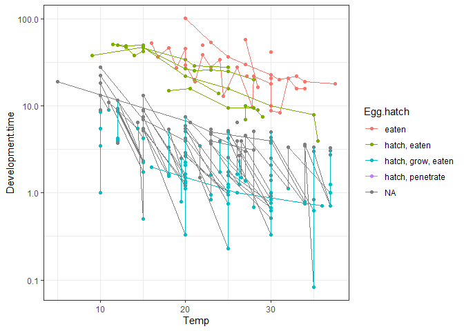<!-- -->

But first we need to address this temperature variation, which from our
perspective is noise. Optimally, one would make a model that accounts
for both within-species variation due to temperature as well as the
between-species effect of phylogeny and transmission strategy. That’s
possible, but perhaps overkill for our modest sample sizes and interests
(i.e. we’re not interested in temperature-dependence here). A simpler
approach that I’ve used previously is to calculate development time in
degree-days (essentially devo time \* temperature).

When we calculate and plot degree days, it looks like it does a fair job
at removing the temperature effect - the lines are now flat. I thus took
the multiple degree day measurments for a species and averaged them.

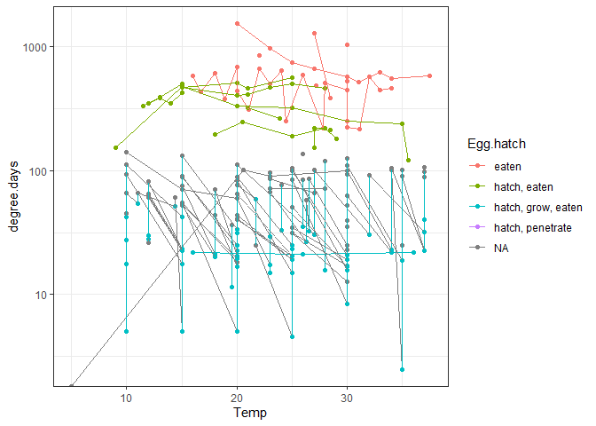<!-- -->

An additional complication is that different species show different
patterns of propagule development. For instance, some species are
released from the host infective, while other species require time for
eggs to embryonate or for free larvae to molt before they are infective.
This info (laid infective or not) was not in the database, though it
could be partially inferred (e.g. a species with data for propagule
development time obviously requires some time developing in the
environment before infectivity). Therefore, I created an additional data
table with just ungulate nematodes and their average propagule
development duration in degree days. In the table, I manually entered
data on whether species were infective when released into the
environment and, if not, their average time to infectivity. This data
was used to compare the alternative transmission strategies.

Here is a table that shows the number of ungulate nematodes that exhibit
the different transmission strategies and whether they are laid
infective or not.

    ##               trans_strat
    ## Laid_infective egg eaten hatched larva\neaten intermediate host\neaten
    ##            no          9                   39                        3
    ##            yes         1                    0                       30

Strikingly, most egg-transmitted species (9/10) need to embryonate
before becoming infective and all larvae-on-herbage species (39/39) need
to molt before infectivity. By contrast, most intermediate
host-transmitted species (30/33) are infective immediately. This makes
sense - the next host is an ungulate for the egg- and larvae-transmitted
species, which avoids faeces, while the next host is an invertebrate for
the complex life cycle species, which may be attracted to faeces.

Now, let’s bring in the phylogeny (see [here](getting_tree_ung_nems.Rmd)
to see how I created it). We’ll plot some variables alongside the tree
to understand the phylogenetic distribution of these propagule traits.

The colors represent whether propagules are released infective or not.
This trait has a clear phylogenetic structure, as we might expect.

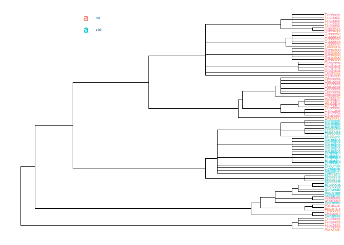<!-- -->

The next plot shows propagule developmental time in degree days in the
right panel next to the tree. Colors represent transmission strategies
(blue - intermediate host transmission, green - larvae on herbage, red -
egg transmission). We can see how zero values (laid infective) align
with strategies. Being infective when released is rare for direct life
cycles (green and red) and common for complex life cycles (blue). Within
clades, though, there does not seem to be too much variation in devo
time.

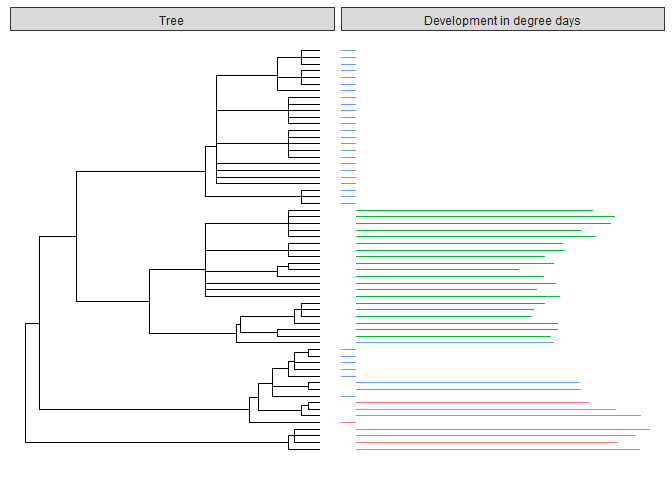<!-- -->

Let’s try fitting a standard phylogenetic regression to this variable,
time to infectivity. One obvious problem is that the variable is
zero-inflated - there are a lot of species laid infective.

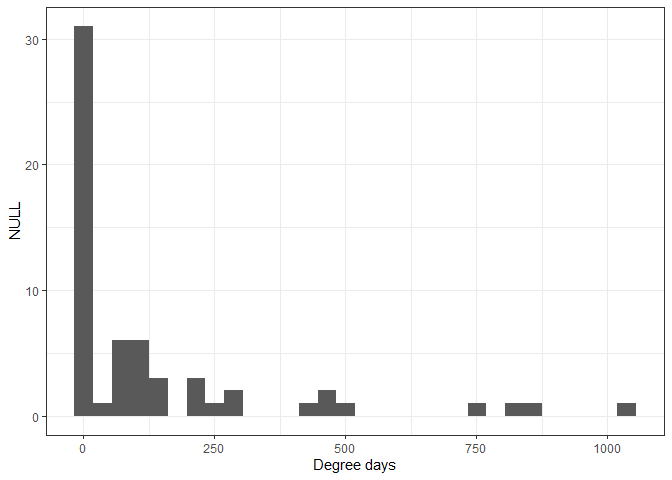<!-- -->

Here is output from the first model of propagule development time,
including all the zeros.

    ## Generalized least squares fit by maximum likelihood
    ##   Model: time_to_infectivity ~ 1 
    ##   Data: red_dat_size 
    ##        AIC      BIC   logLik
    ##   821.4061 827.7387 -407.703
    ## 
    ## Correlation Structure: corPagel
    ##  Formula: ~1 
    ##  Parameter estimate(s):
    ##     lambda 
    ## -0.1094059 
    ## 
    ## Coefficients:
    ##               Value    Std.Error  t-value p-value
    ## (Intercept) 153.097 2.223837e-06 68843643       0
    ## 
    ## Standardized residuals:
    ##         Min          Q1         Med          Q3         Max 
    ## -0.67456088 -0.67456088 -0.67456088 -0.08129784  3.89676815 
    ## 
    ## Residual standard error: 226.9581 
    ## Degrees of freedom: 61 total; 60 residual

Lamda is negative, which suggests closely related species are less
similar than expected by chance. This is suspicious, since the zero
values (infective or not) are so strongly structured by phylogeny. Here
is the model’s residual plot. It is very skewed, which violates model
assumptions.

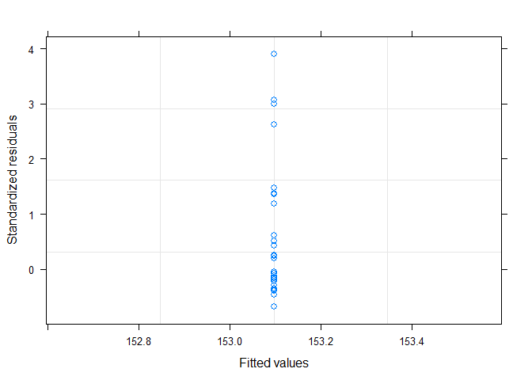<!-- -->

Thus, I think I need to treat propagule development as two traits: 1)
are the propagules released infective into the environment, yes or no,
and 2) if no, how long, in degree days, does it take to reach
infectivity.

The first trait is binomial (infective upon release or not) and thus
requires a more complex model, a generalized linear model with binomial
errors that are phylogenetically correlated. I could try to fit a model
like that, but not quickly (it’s more complicated than a standard GLS
and would probably suffer from the limited variation within strategies).
So I skip that for now and focus on the second trait, developmental
time.

When we exclude the species released infective (i.e. the zero values),
we can see that there is not pronounced phylogenetic structure,
i.e. devo time does not vary much clade to clade.

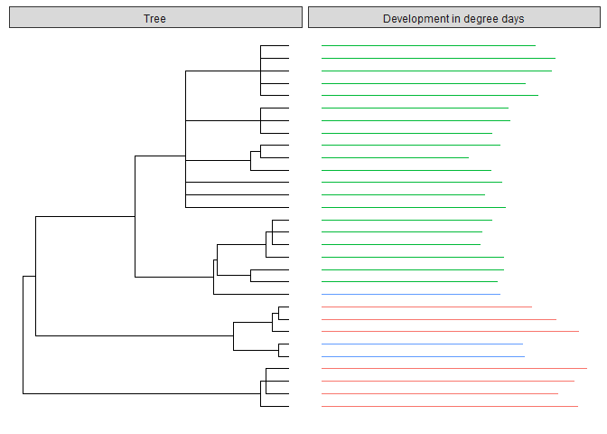<!-- -->

When we log transform degree days and fit the same GLS model to this
more limited dataset, then we have a much nicer (normally-distributed)
residual plot.

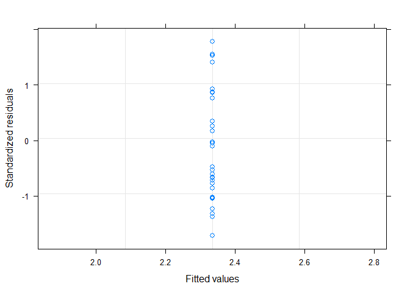<!-- -->

Here’s the model output.

    ## Generalized least squares fit by maximum likelihood
    ##   Model: log10(time_to_infectivity) ~ 1 
    ##   Data: red_dat_size 
    ##        AIC      BIC    logLik
    ##   29.43149 33.63508 -11.71575
    ## 
    ## Correlation Structure: corPagel
    ##  Formula: ~1 
    ##  Parameter estimate(s):
    ##    lambda 
    ## 0.3367055 
    ## 
    ## Coefficients:
    ##                Value Std.Error  t-value p-value
    ## (Intercept) 2.334357 0.1337186 17.45723       0
    ## 
    ## Standardized residuals:
    ##        Min         Q1        Med         Q3        Max 
    ## -1.7080372 -0.8334693 -0.5059453  0.6534082  1.7759315 
    ## 
    ## Residual standard error: 0.3838164 
    ## Degrees of freedom: 30 total; 29 residual

The lambda value is positive (0.3), but moderate enought to be
insignificant, consistent with the notion that developmental times are
not strongly determined by phylogeny.

    ##      Model df      AIC      BIC    logLik   Test  L.Ratio p-value
    ## reg0     1  2 29.38558 32.18797 -12.69279                        
    ## reg1     2  3 29.43149 33.63508 -11.71575 1 vs 2 1.954088  0.1621

Now, let’s add our transmission strategies to the model. This is a
highly significant improvement. Interestingly, lambda goes way up to
0.8, suggesting strong phylogenetic structure once accounting for the
transmission strategies.

    ## Generalized least squares fit by maximum likelihood
    ##   Model: log10(time_to_infectivity) ~ trans_strat 
    ##   Data: red_dat_size 
    ##          AIC      BIC   logLik
    ##   -0.5428131 6.463174 5.271407
    ## 
    ## Correlation Structure: corPagel
    ##  Formula: ~1 
    ##  Parameter estimate(s):
    ##    lambda 
    ## 0.8396478 
    ## 
    ## Coefficients:
    ##                                          Value  Std.Error   t-value
    ## (Intercept)                          2.7824026 0.16258987 17.113013
    ## trans_strathatched larva\neaten     -0.7064652 0.08813568 -8.015655
    ## trans_stratintermediate host\neaten -0.5088017 0.14200254 -3.583047
    ##                                     p-value
    ## (Intercept)                          0.0000
    ## trans_strathatched larva\neaten      0.0000
    ## trans_stratintermediate host\neaten  0.0013
    ## 
    ##  Correlation: 
    ##                                     (Intr) trn_le
    ## trans_strathatched larva\neaten     -0.348       
    ## trans_stratintermediate host\neaten -0.244  0.576
    ## 
    ## Standardized residuals:
    ##          Min           Q1          Med           Q3          Max 
    ## -1.316874779 -0.450046211  0.005397004  0.419082282  1.949119094 
    ## 
    ## Residual standard error: 0.3015879 
    ## Degrees of freedom: 30 total; 27 residual

    ##      Model df       AIC      BIC     logLik   Test L.Ratio p-value
    ## reg1     1  3 29.431490 33.63508 -11.715745                       
    ## reg2     2  5 -0.542813  6.46317   5.271407 1 vs 2 33.9743  <.0001

This plot compares propagule developmental times. The species
transmitted via eggs have the longest development times, while those
that hatch have the shortest.

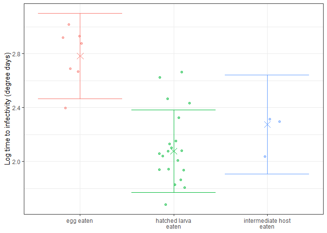<!-- -->

# Conclusions

We argued that species transmitted to ungulates via eggs experience the
most acute trophic vacuum, due to ungulate faeces avoidance. The pattern
of egg development supports this. These species are usually released
uninfective and then require long developmental times, presumably
allowing time for dispersal away from the faeces. The opposite strategy
is exhibited by complex life cycle parasites - they are usually released
already infective and in the unusual case when not only require short
developmental times. The species exhibiting the larvae-on-herbage
transmission strategy appear intermediate. They belong to a single clade
(Trichostrongyles) and always require time outside the host to molt to
an infective stage. The time to infectivity is comparatively short, but
combined with the larva’s mobility, may be sufficient to promote some
dispersal away from the faeces.

### Make a figure for publication

    ## # A tibble: 24 x 20
    ## # Groups:   Parasite.species, Host.no [24]
    ##    Parasite.species Host.no Def.int host.bm Parasite.group   lcl adult_biov
    ##    <chr>              <int> <chr>     <dbl> <chr>          <int>      <dbl>
    ##  1 Cystocaulus ocr~       2 def      59549. nematode           2     0.777 
    ##  2 Elaphostrongylu~       2 def     408700. nematode           2     3.38  
    ##  3 Elaphostrongylu~       2 def     117342. nematode           2     1.85  
    ##  4 Elaphostrongylu~       2 def     101107. nematode           2     1.62  
    ##  5 Gnathostoma dol~       4 def     108486. nematode           4   NaN     
    ##  6 Gnathostoma his~       4 def     108486. nematode           4   147.    
    ##  7 Muellerius capi~       2 def      47466. nematode           2     0.0692
    ##  8 Neostrongylus l~       2 def      47466. nematode           2     0.0179
    ##  9 Parelaphostrong~       2 def      82351. nematode           2     0.370 
    ## 10 Parelaphostrong~       2 def     163059. nematode           2     1.21  
    ## # ... with 14 more rows, and 13 more variables: adult_dt <dbl>,
    ## #   complex <chr>, hatch <chr>, trans_strat <chr>, propagule_eaten <chr>,
    ## #   propagule_size_eaten <dbl>, propagule_growth_start <chr>,
    ## #   propagule_size_grow_start <dbl>, Egg.hatch <chr>,
    ## #   Laid_infective <chr>, devo_egg <dbl>, devo_free_larva <dbl>,
    ## #   time_to_infectivity <dbl>

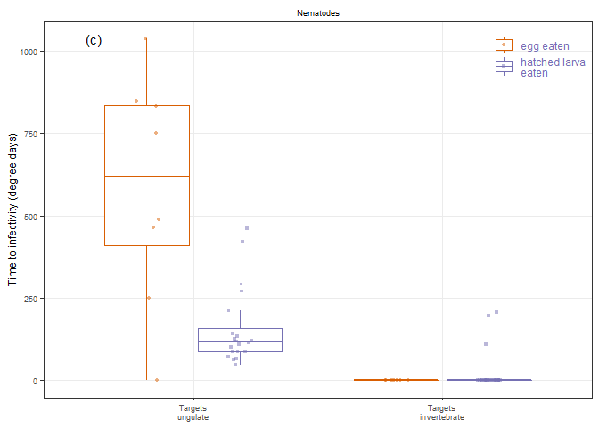<!-- -->

The above figure was meant for the BOX in the manuscript. I also want to
compare these groups statistically, so let’s run one more set of
phylogenetic regressions.

When I compare a model with and without these four groups, the model
with them is signficantly better.

    ##       Model df      AIC      BIC    logLik   Test  L.Ratio p-value
    ## regx0     1  2 835.6520 839.8407 -415.8260                        
    ## regx      2  5 789.6968 800.1685 -389.8484 1 vs 2 51.95523  <.0001

    ## Generalized least squares fit by maximum likelihood
    ##   Model: time_to_infectivity ~ complex * hatch 
    ##   Data: red_dat_size 
    ##        AIC      BIC    logLik
    ##   789.6968 800.1685 -389.8484
    ## 
    ## Correlation Structure: corPagel
    ##  Formula: ~1 
    ##  Parameter estimate(s):
    ## lambda 
    ##      1 
    ## 
    ## Coefficients:
    ##                                             Value Std.Error   t-value
    ## (Intercept)                               36.3523 173.23865  0.209839
    ## complexdirect                            483.4953  59.89055  8.072982
    ## hatchhatched larva\neaten                 29.6843  54.17227  0.547962
    ## complexdirect:hatchhatched larva\neaten -416.6766  74.29795 -5.608185
    ##                                         p-value
    ## (Intercept)                              0.8346
    ## complexdirect                            0.0000
    ## hatchhatched larva\neaten                0.5859
    ## complexdirect:hatchhatched larva\neaten  0.0000
    ## 
    ##  Correlation: 
    ##                                         (Intr) cmplxd htchle
    ## complexdirect                           -0.164              
    ## hatchhatched larva\neaten               -0.250  0.450       
    ## complexdirect:hatchhatched larva\neaten  0.137 -0.780 -0.548
    ## 
    ## Standardized residuals:
    ##         Min          Q1         Med          Q3         Max 
    ## -1.50871370 -0.19165304 -0.13209446 -0.03271389  1.50234247 
    ## 
    ## Residual standard error: 344.5635 
    ## Degrees of freedom: 60 total; 56 residual

Given the combination of phylogenetic structure and a lack of variation
in some groups, the lambda parameter could not be estimated. Instead, I
fixed it at one, which assumes high phylogenetic structure. The results
are the same if I assume a lamda value of 0 (no phylogenetic structure).

    ##       Model df      AIC      BIC    logLik   Test L.Ratio p-value
    ## regx0     1  2 828.4513 832.6400 -412.2257                       
    ## regx      2  5 773.6077 784.0794 -381.8039 1 vs 2 60.8436  <.0001

Make one more figure, similar to previous one, for GfO presentation.

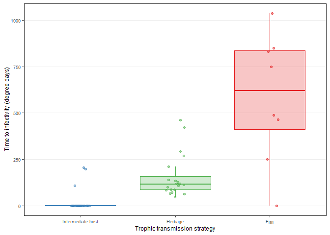<!-- -->
