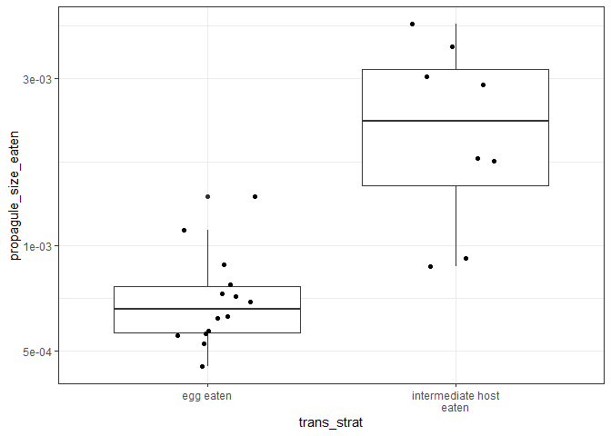
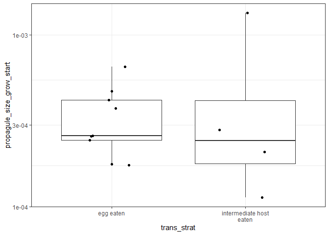
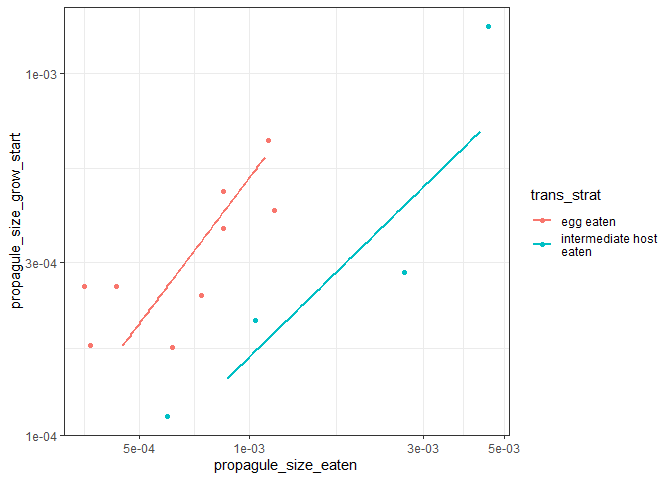
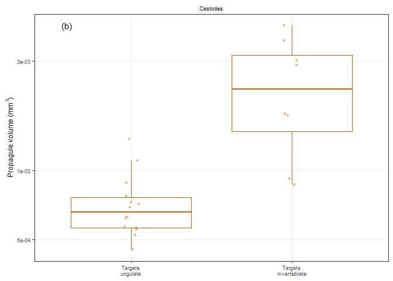
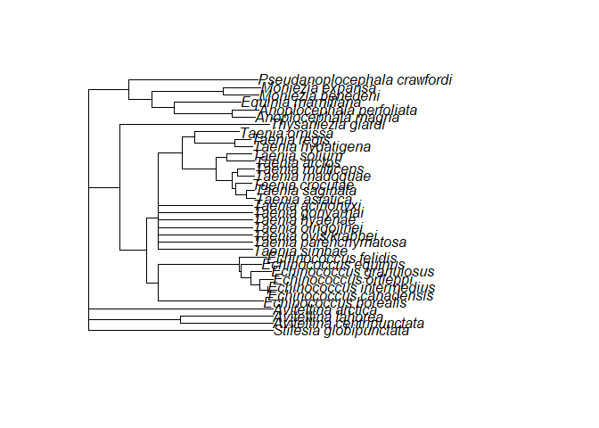
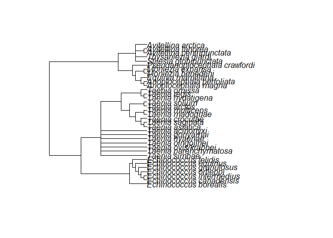
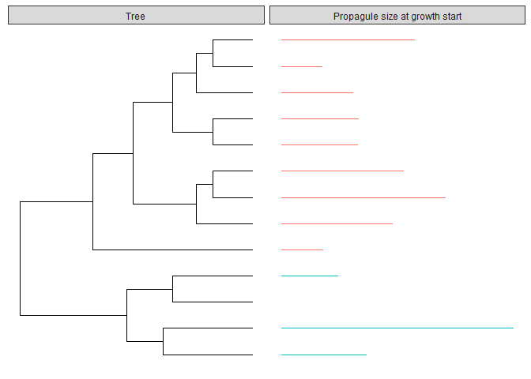
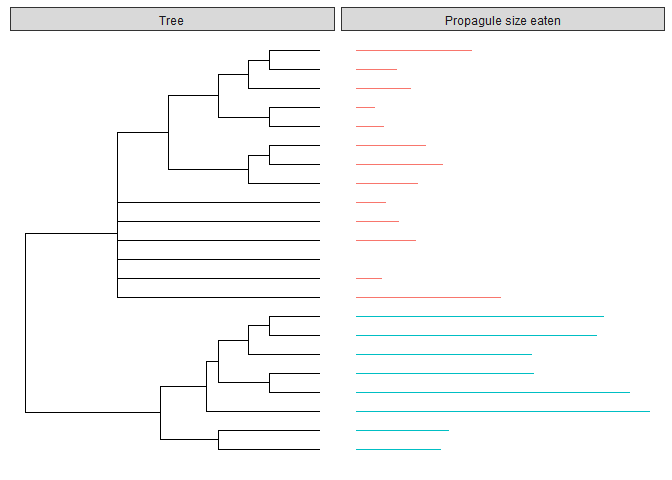

Ungulate cestode life history - Propagules
================

I use the life cycle database to explore ideas about the costs and
benefits of different infection routes exhibited by helminths of grazing
mammals (ungulates). In this document, I specifically focus on cestode
propagules. In essence, I compare two taxa, (i) taeniids that are
egg-transmitted and use ungulates as intermediate hosts and (ii)
anoplocephalids that are transmitted to ungulates by mite intermediate
hosts. My main goal is to see if patterns in nematodes are also observed
in cestodes.

We can start by comparing the propagule sizes of these two groups. The
bigger eggs belong to anoplocephalids, the worms targeting mites as next
host.

<!-- -->

This is not the pattern seen in nematodes. In nematodes, egg-to-ungulate
species had larger propagules than species transmitted to an
intermediate host. A couple differences may be relevant. First,
egg-to-ungulate cestodes (Taeniids) are transmitted via carnivore
faeces, whereas the egg-transmitted nematodes have direct cycles and are
thus transmitted by ungulate faeces. Faecal avoidance behaviors and the
trophic vacuum they cause may differ between these groups. Second,
cestode eggs are often packed within full proglottids, which may or may
not disintegrate upon release into the environment. In other words, it
is unclear if the size of a single egg or the size of a proglottid best
represents the propagule consumed by the target host.

When we look at embryo size within eggs (oncospheres), we see that they
are quite comparable.

<!-- -->

Both groups belong to Cyclophyllidea and I believe cyclophyllideans have
rather similar oncospheres. Apparently, the eggs of anoplocephalids have
a thicker shell than those of taeniids, causing their larger overall
size. A quick google image search confirms this, e.g. the large,
irregular shell is even diagnostic for *Moniezia*, the best studied
anoplocephalid.

There is a bit of a tendency for larger eggs to harbor larger embryos in
both groups, though the ratio is different, because anoplocephalids
(blue) have large shells relative to the size of the embryo.

<!-- -->

In nematodes, we found an association between transmission strategy and
propagule development - propagules targeting ungulates developed in the
external environment, while those targeting intermediate hosts did not.
We could not confirm this pattern in cestodes. Both taeniids and
anoplocephalids are released into the external environment infective
(i.e. the eggs are embryonated).

Some cestodes require egg development and hatching before transmission
to the first host. When we isolate the cestode species with data for
propagule developmental time, we see that they all target aquatic first
hosts.

| Parasite.species              | Host.no | Host.common.name | Host.habitat |
| :---------------------------- | ------: | :--------------- | :----------- |
| Archigetes iowensis           |       1 | oligochaete      | freshwater   |
| Archigetes limnodrili         |       1 | oligochaete      | freshwater   |
| Archigetes sieboldi           |       1 | oligochaete      | freshwater   |
| Atractolytocestus sagittatus  |       1 | oligochaete      | freshwater   |
| Biacetabulum infrequens       |       1 | oligochaete      | freshwater   |
| Biacetabulum macrocephalum    |       1 | oligochaete      | freshwater   |
| Bothridium pythonis           |       1 | copepod          | freshwater   |
| Bothriocephalus acheilognathi |       1 | copepod          | freshwater   |
| Bothriocephalus claviceps     |       1 | copepod          | freshwater   |
| Bothriocephalus rarus         |       1 | copepod          | freshwater   |
| Callotetrarhynchus nipponica  |       1 | copepod          | marine       |
| Cyathocephalus truncatus      |       1 | amphipod         | freshwater   |
| Diphyllobothrium dendriticum  |       1 | copepod          | freshwater   |
| Diphyllobothrium ditremum     |       1 | copepod          | freshwater   |
| Diphyllobothrium latum        |       1 | copepod          | freshwater   |
| Glaridacris catostomi         |       1 | oligochaete      | freshwater   |
| Glaridacris confusa           |       1 | oligochaete      | freshwater   |
| Hunterella nodulosa           |       1 | oligochaete      | freshwater   |
| Khawia baltica                |       1 | oligochaete      | freshwater   |
| Khawia japonensis             |       1 | oligochaete      | freshwater   |
| Khawia sinensis               |       1 | oligochaete      | freshwater   |
| Ligula intestinalis           |       1 | copepod          | freshwater   |
| Monobothrium hunteri          |       1 | oligochaete      | freshwater   |
| Monobothrium ingens           |       1 | oligochaete      | freshwater   |
| Monobothrium ulmeri           |       1 | oligochaete      | freshwater   |
| Poecilancistrium caryophyllum |       1 | copepod          | marine       |
| Prochristianella hispida      |       1 | copepod          | marine       |
| Schistocephalus pungitii      |       1 | copepod          | freshwater   |
| Schistocephalus solidus       |       1 | copepod          | freshwater   |
| Spirometra erinacei           |       1 | copepod          | freshwater   |
| Spirometra mansonoides        |       1 | copepod          | freshwater   |

Thus, I am unaware of any tapeworm species that releases unembryonated
eggs into a terrestrial environment that require development before
becoming infective.

# Conclusions

Patterns of propagule size and development are not the same in
ungulate-infecting cestodes and nematodes. Cestodes targeting
invertebrate intermediate hosts have larger propagules than those
targeting ungulates, which is not the same pattern observed in
nematodes. Nematode transmission strategies are related to their
propagule development, whereas in cestodes there is simply no variation
in propagule development (i.e. they are all embryonated). It is unclear
if this incongruence is caused by ecological differences in transmission
(e.g. eggs in carnivore faeces in taeniids instead of ungulate faeces)
or by phylogenetic constraints (e.g. propagule development being less
constrained in nematodes).

### Make a figure for publication

    ## # A tibble: 6 x 15
    ## # Groups:   Parasite.species, Host.no [6]
    ##   Parasite.species Host.no Def.int host.bm Parasite.group   lcl adult_biov
    ##   <chr>              <int> <chr>     <dbl> <chr>          <int>      <dbl>
    ## 1 Anoplocephala m~       2 def     340000  cestode            2      9625 
    ## 2 Anoplocephala p~       2 def        NaN  cestode            2       605 
    ## 3 Avitellina arct~       2 def      80328. cestode            2      5940.
    ## 4 Avitellina cent~       2 def     140000. cestode            2      5085.
    ## 5 Avitellina laho~       2 def      59549. cestode            2      2776.
    ## 6 Echinococcus bo~       1 int     297942. cestode            2       NaN 
    ## # ... with 8 more variables: adult_dt <dbl>, complex <chr>, hatch <chr>,
    ## #   trans_strat <chr>, propagule_eaten <chr>, propagule_size_eaten <dbl>,
    ## #   propagule_growth_start <chr>, propagule_size_grow_start <dbl>

<!-- -->

### Phylogenetic analyses

Read in megatree to which database species have been added by their
taxonomy.

Which species need to be added?

    ## character(0)

Make subtree for just the cestodes infecting ungulates.

The anoplocephalids are not monophyletic in megatree, which is probably
incorrect. Put them all in the same clade manually.

<!-- -->

During rearranging, I removed the branch lengths, so the tree looks like
this.

<!-- -->

Let’s look at the distribution of propagule sizes across the phylogeny
of ungulate worms, starting with embryo size. Here is the tree on the
left with bars representing oncosphere size on the right.

<!-- -->

There is little difference between the two clades in embryo size. Moving
on to egg size, which is what the next host consumes, a clearer
difference emerges. Anoplocephalids (blue) have larger eggs than
taeniids (red) - essentially the shell is thicker.

<!-- -->

Now, we will fit some phylogenetic GLS models to assess the significance
of these differences.

Lambda was estimated to be 0.66 indicating moderate phylogenetic
structure in egg size.

    ## Generalized least squares fit by maximum likelihood
    ##   Model: log10(propagule_size_eaten) ~ 1 
    ##   Data: red_dat_size 
    ##        AIC      BIC    logLik
    ##   11.73872 15.01184 -2.869358
    ## 
    ## Correlation Structure: corPagel
    ##  Formula: ~1 
    ##  Parameter estimate(s):
    ##    lambda 
    ## 0.6568984 
    ## 
    ## Coefficients:
    ##                 Value Std.Error   t-value p-value
    ## (Intercept) -2.924318 0.1354405 -21.59116       0
    ## 
    ## Standardized residuals:
    ##        Min         Q1        Med         Q3        Max 
    ## -1.3413432 -0.8988465 -0.5141190  0.4462655  1.7758694 
    ## 
    ## Residual standard error: 0.3136391 
    ## Degrees of freedom: 22 total; 21 residual

While large, lambda was not significantly greater than 0, and thus the
likelihood ratio test between models with and without phylogeny was not
significant.

    ##      Model df      AIC      BIC    logLik   Test  L.Ratio p-value
    ## reg0     1  2 12.01253 14.19462 -4.006266                        
    ## reg1     2  3 11.73872 15.01184 -2.869358 1 vs 2 2.273816  0.1316

When we add parasite transmission strategy to the model (i.e. targets
ungulates or targets invertebrates), there were problems with model
fitting, presumably because lambda could not be estimated because
phylogeny and transmission strategy are tightly linked. Therefore, three
models were tested with a fixed value lambda: no phylogenetic signal
(lambda = 0), moderate signal (0.5), and strong signal (1).

Regardless of which value lambda takes, adding transmission strategy to
the model is a significant improvement according to likelihood ratio
tests.

    ##        Model df       AIC       BIC    logLik   Test  L.Ratio p-value
    ## reg1       1  2  9.738801 11.920885 -2.869400                        
    ## reg2.0     2  3 -7.159034 -3.885907  6.579517 1 vs 2 18.89784  <.0001

    ##         Model df       AIC       BIC   logLik   Test  L.Ratio p-value
    ## reg1        1  2  9.738801 11.920885 -2.86940                        
    ## reg2.05     2  3 -3.971720 -0.698592  4.98586 1 vs 2 15.71052   1e-04

    ##        Model df      AIC       BIC    logLik   Test  L.Ratio p-value
    ## reg1       1  2 9.738801 11.920885 -2.869400                        
    ## reg2.1     2  3 3.712416  6.985544  1.143792 1 vs 2 8.026384  0.0046

It probably makes sense to report the most conservative test, where
lambda is estimated to be 1. In this case, phylogeny is assumed to
strongly affect egg size, leaving less variation to be explained by
transmission strategy.

    ## Generalized least squares fit by maximum likelihood
    ##   Model: log10(propagule_size_eaten) ~ trans_strat 
    ##   Data: red_dat_size 
    ##        AIC      BIC   logLik
    ##   3.712416 6.985544 1.143792
    ## 
    ## Correlation Structure: corPagel
    ##  Formula: ~1 
    ##  Parameter estimate(s):
    ## lambda 
    ##      1 
    ## 
    ## Coefficients:
    ##                                          Value Std.Error    t-value
    ## (Intercept)                         -3.1309993 0.1757309 -17.817008
    ## trans_stratintermediate host\neaten  0.4844832 0.1398342   3.464697
    ##                                     p-value
    ## (Intercept)                          0.0000
    ## trans_stratintermediate host\neaten  0.0024
    ## 
    ##  Correlation: 
    ##                                     (Intr)
    ## trans_stratintermediate host\neaten -0.382
    ## 
    ## Standardized residuals:
    ##        Min         Q1        Med         Q3        Max 
    ## -1.3132275 -0.3728469 -0.1589440  0.3133093  0.8865565 
    ## 
    ## Residual standard error: 0.3149041 
    ## Degrees of freedom: 22 total; 20 residual
