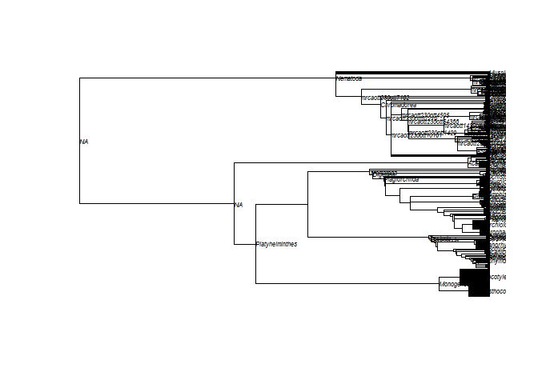
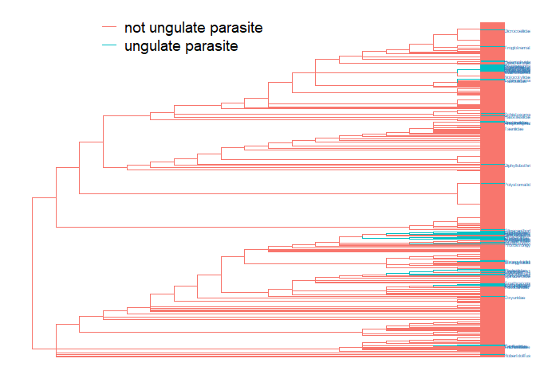
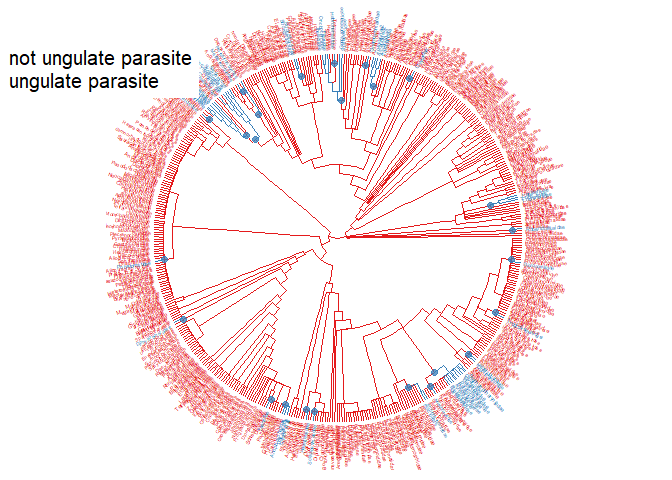
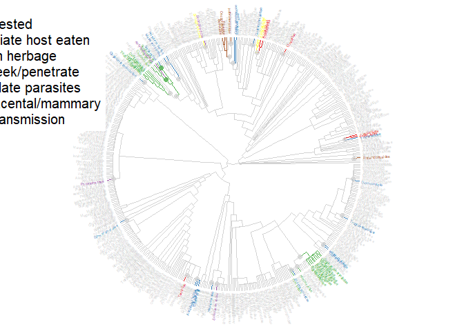

Map states onto trees
================

Here I want to determine how often different transmission strategies to
ungulate hosts have evolved. To that end, I want to map anceestral
states to see 1) how often ungulates have been invaded and 2) what
routes were taken to infect them.

Here is the tree of helminth families, acquired from the open tree of
life. I [improved](improve_tree.Rmd) the tree manually using taxonomy
and existing phylogenies.

<!-- -->

I reduced the dataset of family names to just include the ones in the
tree.

There are more rows in data than tip labels. This is because some
families were synonomized, resulting in several rows in the data with
the same family (otl) name.

    ## # A tibble: 27 x 2
    ##    otl_name              n
    ##    <chr>             <int>
    ##  1 Acanthocolpidae       2
    ##  2 Anisakidae            2
    ##  3 Apocreadiidae         3
    ##  4 Aporocotylidae        2
    ##  5 Aspidogastridae       2
    ##  6 Azygiidae             2
    ##  7 Brachycladiidae       3
    ##  8 Brumptidae            2
    ##  9 Cephalobothriidae     2
    ## 10 Cephalogonimidae      2
    ## # ... with 17 more rows

For those with multiple OTL entries for a given OTL name, I just took
the first name.

After making the trait data and tree consistent regarding names and
order, I can start mapping. Let’s look at the distribution of tip
states.

    ## 
    ##  not ungulate parasites       larvae on herbage intermediate host eaten 
    ##                     423                      20                      18 
    ##           eggs ingested     vector-transmission   larvae seek/penetrate 
    ##                       6                       5                       4 
    ## trans-placental/mammary 
    ##                       3

Most families of ungulate parasites are transmitted either as larvae on
herbage or via an intermediate host. Non-trophic strategies, like
vector-transmission and penetration are less common.

I am going to keep the mapping simple and use a parsimony algorithm. It
is fast and requires few assumptions about transition costs,
reversibility, and so on.

After running the parsimony algorithm, let’s plot the output, with
ancestral states represented by colors on the tree.

<!-- -->
Evolutionary invasions of ungulates has occurred throughout the tree.
This is no surprise. I did not need to do mapping to know that ungulates
harbor a phylogenetically diverse community of parasitic worms.

Let’s highlight the spots on the tree where transitions occured. We’ll
also plot as a circular phylogeny to improve the figures ‘readability’.

<!-- -->

How many transitions to ungulate parasitism were counted?

    ## [1] 25

We can write this tree to file.

Now let’s split the ‘ungulate parasite’ group into multiple groups,
depending on how they infect ungulates. First, we define three trophic
transmission strategies: 1. eggs ingested 2. free larvae ingested 3.
intermediate host ingested

And then 3 additional non-trophic strategies: 4. active larvae,
seek/penetrate 5. vector transmission 6. no free propagule -
transmammary, transplacental or cannabilistic transmission

Then we re-map these onto the tree with parsimony.

How many transitions were identified here?

    ## [1] 28

Why were more transitions identified when mapping transmission routes,
as opposed to just ungulate parasitism? Shouldn’t every transition to
ungulate parasitism be associated with one evolutionary change in
transmission route? The additional transitions can be understood,
because each transition to ungulate parasitism can be associated with
multiple transmission strategies. For example, the clade of trichinellid
and trichurid nematodes both infect ungulates (one origin), but they use
different strategies to do so.

<!-- -->

The plot shows the transitions.

A few descriptive stats mentioned in manuscript text…

How many taxa were in tree?

    ## [1] 475

How many origins were counted manually?

    ## [1] 31

How many ungulate families were in data?

    ## [1] 56

How many families result from each origin of ungulate parasitism?

    ## [1] 1.806452

How does this ‘diversification rate’ compare across transmission types?

    ## # A tibble: 6 x 4
    ##   trans_route             n_fams origins fams_origin
    ##   <fct>                    <int>   <dbl>       <dbl>
    ## 1 eggs ingested                6       4        1.5 
    ## 2 larvae on herbage           20       4        5   
    ## 3 intermediate host eaten     18      14        1.29
    ## 4 larvae seek/penetrate        4       4        1   
    ## 5 vector-transmission          5       3        1.67
    ## 6 trans-placental/mammary      3       2        1.5

Herbage transmission is the outlier with seemingly higher
diversification rates. What is the diversification rate across the rest
of the tree, excluding this transmission route?

    ## [1] 1.333333
